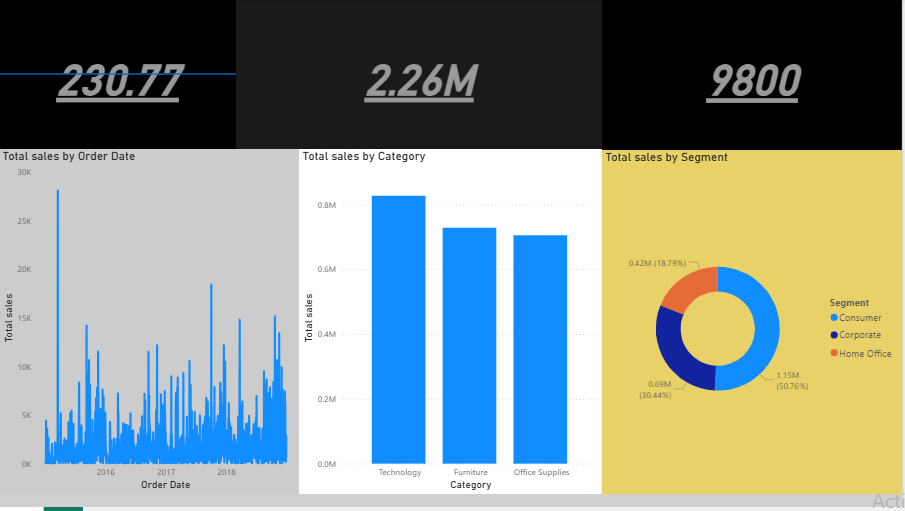

# 📊 Sales Analytics Dashboard (Power BI)

## 🚀 Overview

An interactive **Sales Analytics Dashboard** built using Power BI to analyze business performance, identify trends, and uncover actionable insights across sales, customers, and product categories.

---

## 📷 Dashboard Preview

---

## 📌 Key Features

* KPI tracking: **Total Sales, Orders, Average Sales**
* Sales trend analysis over time
* Category-wise performance comparison
* Customer segment analysis

---

## 🛠 Tools & Technologies

* Power BI
* DAX (SUM, AVERAGE, COUNTROWS)
* Power Query (Data Cleaning & Transformation)

---

## 📈 Key Insights

* Identified top-performing product categories contributing maximum revenue
* Observed sales trends and seasonal patterns
* Analyzed customer segments to understand high-value customers

---

## 📂 Project Files

* 📊 Power BI File:
  
---

## 🎯 What I Learned

* Building interactive and user-friendly dashboards
* Writing DAX measures for KPI calculation
* Transforming raw data into meaningful insights

---

## 🔗 Additional Resources

* Dashboard Image:
  https://github.com/vedantrathod-git/sales-analytical-dashboard/blob/main/analysis.png
